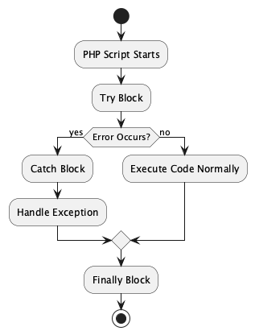

# What is an Error?

An **error** is an issue in the program that cannot usually be handled by the program itself. Errors are often caused by problems outside the program's control, such as hardware failures, running out of memory, or syntax mistakes. In PHP, errors are typically fatal and stop the execution of the script.

**Examples:**
- Parse errors (syntax mistakes)
- Fatal errors (calling undefined functions)
- Memory limit exceeded

---

# What is an Exception?

An **exception** is an object that describes an unusual or erroneous situation that occurs during the execution of a program. Exceptions can be handled in code using `try`, `catch`, and `finally` blocks, allowing the program to continue running or to fail gracefully.

**Examples:**
- Division by zero
- File not found
- Invalid user input

---

# Key Differences

| Errors                        | Exceptions                      |
|-------------------------------|---------------------------------|
| Cannot be handled in code     | Can be handled using `try-catch`|
| Usually fatal                 | Can be non-fatal                |
| Occur at compile or runtime   | Occur at runtime                |
| Examples: syntax errors,      | Examples: invalid input,        |
| memory errors                 | file not found                  |

---


# Why use Exception Handling

- **Prevents abrupt termination**  
  Ensures that scripts do not crash unexpectedly and allows graceful recovery from errors.

- **Separates error-handling from business logic**  
  Keeps the core functionality clean and readable by isolating error management code.

- **Improves maintainability and debugging**  
  Makes it easier to identify, fix, and manage errors throughout the codebase.

---

# Basic Syntax of Exception Handling in PHP

- **try** block:  
  Wraps the code that may cause an exception.

- **throw** statement:  
  Used to trigger an exception manually.

- **catch** block:  
  Catches and handles the exception thrown.

```php
try {
  // Code that may throw an exception
  throw new Exception("Something went wrong!");
} catch (Exception $e) {
  echo 'Caught exception: ', $e->getMessage();
}
```

---

# The `try` Block

- Contains code that may throw exceptions
- Keeps risky code isolated
- **Best practice**: Keep `try` blocks small and focused


---

# The `throw` Statement

- Used to trigger exceptions manually
- Can be used with built-in or custom exceptions

```php
// PHP example (as in your original code)
if ($age < 18) {
  throw new Exception("Underage signup not allowed.");
}
```
---

# The `catch` Block

- Catches exceptions thrown in `try`
- Provides code to handle the problem
- Can have multiple `catch` blocks for different exceptions

```php
try {
  $result = 10 / 0;
} catch (DivisionByZeroError $e) {
  echo "Error: " . $e->getMessage();
}

```
---


# The `finally` Block


- Runs regardless of whether exception occurred.

- Often used for cleanup operations (closing files, DB connections).


```php
try {
  // Code
} catch (Exception $e) {
  echo $e->getMessage();
} finally {
  echo "Cleanup done!";
}
```

---

# Exception Handling Flow in PHP



---

# Multiple `catch` Blocks in PHP

- PHP supports **multiple `catch` blocks** to handle different types of exceptions.
- Each `catch` block can target a specific exception class.

```php
try {
  // Some code that might throw different types of exceptions
  throw new TypeError("Invalid type!");
} catch (TypeError $e) {
  echo "Caught a TypeError: " . $e->getMessage();
} catch (Exception $e) {
  echo "Caught a general Exception: " . $e->getMessage();
}

```

---

# Before PHP 7.1
- Only one type of exception could be caught in each `catch` block.  
- Developers had to **duplicate code** if multiple exceptions required the same handling.

```php
try {
   // Code that may throw an Exception or ArithmeticError.
} catch (ArithmeticError $e) {
   // handle error
} catch (Exception $e) {
   // handle error
}
```
---

# Why Use Multiple `catch` Blocks?

- Improves **readability** and **code structure**
- Allows **different actions** for different error types
- Makes debugging easier by **isolating error causes**

---


# Nested try catch Blocks

- One try block inside another.

- Useful for handling different levels of exceptions.

```php
try {
  try {
    throw new Exception("Inner error");
  } catch (Exception $e) {
    echo "Caught inner: " . $e->getMessage();
    throw $e;
  }
} catch (Exception $e) {
  echo "Caught outer: " . $e->getMessage();
}

```

---


# PHP 7.1 Multiple Exception Handling

- **Definition**: PHP 7.1 introduced the ability to catch multiple exceptions in a single `catch` block using the pipe (`|`) operator.  
- **Analogy**: Like having a single *"safety net"* that can catch different kinds of thrown objects.  
- **Example**: Handling both `ArithmeticError` and `Exception` without duplicating catch blocks.  

```php
try {
   // Code that may throw an Exception or ArithmeticError.
} catch (ArithmeticError | Exception $e) {
   // pass
}
```
---


# Exception Chaining in PHP

Exception chaining allows you to:

- Catch an exception

- Wrap it inside a new exception

- Throw the new exception while preserving the original one

---

# Key Benefits

- **Preserves the full error history** (stack trace)
- **Adds contextual information** at each level
- **Makes debugging easier** by showing the complete flow

---

# Basic Syntax of Exception Chaining in PHP

```php
try {
    // Some code that may fail
} catch (SpecificException $e) {
    throw new CustomException(
        "Higher-level error message", 
        0, // Error code
        $e  // Previous exception (chaining)
    );
}
```
---


# Practical Example of Exception Chaining

```php

error_reporting(E_ALL);
ini_set('display_errors', 1);

class DatabaseConnectionException extends RuntimeException {}

function connectToDatabase($host, $user, $password, $database) {
    $mysqli = @new mysqli($host, $user, $password, $database);

    if ($mysqli->connect_errno) {
        throw new DatabaseConnectionException(
            "Database connection failed: " . $mysqli->connect_error,
            $mysqli->connect_errno
        );
    }

    return $mysqli; // successful connection
}

try {
    connectToDatabase("localhost", "wrong_user", "wrong_pass", "wrong_db");
} catch (DatabaseConnectionException $e) {
    echo "New message: " . $e->getMessage();
}
```

---

# Practical Example of Exception Chaining

```php

<?php
class DatabaseConnectionException extends RuntimeException {}

function connectToDatabase($host, $user, $password, $database) {
    // Enable exception mode for mysqli
    mysqli_report(MYSQLI_REPORT_ERROR | MYSQLI_REPORT_STRICT);

    try {
        $mysqli = new mysqli($host, $user, $password, $database);
        $mysqli->set_charset("utf8mb4"); // optional: set charset
        return $mysqli;
    } catch (mysqli_sql_exception $e) {
        throw new DatabaseConnectionException(
            "Database connection failed", 
            500, 
            $e
        );
    }
}

try {
    connectToDatabase("localhost", "wrong_user", "wrong_pass", "wrong_db");
} catch (DatabaseConnectionException $e) {
    echo "New message: " . $e->getMessage();
}
```

---

# Exception Class Hierarchy in PHP

- All exceptions derive from **Throwable**,  Two main branches:

- Exception
- Error

---


# Commonly Used Built-in Error Classes in PHP

| **Error Class**             | **Description**                                                                 |
|------------------------------|---------------------------------------------------------------------------------|
| `Error`                      | Base class for all internal PHP errors.                                         |
| `TypeError`                  | Thrown when a function argument or return value is of the wrong type.           |
| `ParseError`                 | Thrown when there is a syntax error during parsing.                             |
| `ArithmeticError`            | Thrown when an illegal arithmetic operation occurs.                             |
| `DivisionByZeroError`        | Subclass of `ArithmeticError`, occurs when dividing a number by zero.           |
| `AssertionError`             | Thrown when an assertion made via `assert()` fails.                             |

---

# Commonly Used Built-in Exception Classes in PHP

| **Exception Class**        | **Description**                                                                 |
|-----------------------------|---------------------------------------------------------------------------------|
| `Exception`                 | Base class for all user-defined and built-in exceptions.                        |
| `RuntimeException`          | Represents errors that occur during the program’s execution.                    |
| `InvalidArgumentException`  | Thrown when an argument is not of the expected type or value.                   |
| `OutOfRangeException`       | Thrown when a value is not within the expected range.                           |
| `LengthException`           | Thrown when the length of an argument is invalid.                               |

---

# Commonly Used Built-in Exception Classes in PHP

| **Exception Class**        | **Description**                                                                 |
|-----------------------------|---------------------------------------------------------------------------------|
| `DomainException`           | Thrown when a value does not adhere to a defined valid data domain.             |
| `LogicException`            | Base class for exceptions that represent errors in program logic.               |
| `OverflowException`         | Thrown when adding an element exceeds the allowed capacity.                     |
| `UnderflowException`        | Thrown when performing an invalid operation on an empty container/structure.    |
| `BadFunctionCallException`  | Thrown when a callback refers to an undefined function.                         |

---

# Practival Example of TypeError in php

A PHP TypeError occurs when you try to perform an operation on a value of the wrong type. Here are the most common causes and solutions for a simple PHP demo:


```~~php~~
<?php
function addNumbers(int $a, int $b) {
    return $a + $b;
}

// This will cause TypeError: Argument must be of type int
$result = addNumbers("5", "10");
$result = addNumbers((int)"5", (int)"10");

?>
```


# Practival Example of TypeError in php


```php

<?php
function getName(): string {
    return null; // This will cause TypeError
}

$name = getName();
echo strtoupper($name); // TypeError: strtoupper(): Argument #1 ($string) must be of type string, null given
?>

```

# Practival Example of ParseError in php

```php
<?php
// This will cause a ParseError because of missing closing parenthesis
echo "Hello World";
```

# Practical Example of File handling Exception

```markdown

- Scenario: Reading a file that may not exist.
- Goal: Handle potential file-related exceptions gracefully.

```

```php
try {
  if (!file_exists("data.txt")) {
    throw new Exception("File not found.");
  }
  $file = fopen("data.txt", "r");
  // Process the file
  fclose($file);
} catch (Exception $e) {
  echo "Error: " . $e->getMessage();
} finally {
  echo "Cleaning up...";
}
```

---

# Best Practices: File Handling Exceptions

- Always check if file exists.

- Handle permissions errors.

- Use finally to close resources.

---


# Example: Database Exception

```php
try {
  $conn = new PDO("mysql:host=localhost;dbname=test", "root", "");
} catch (PDOException $e) {
  echo "Connection failed: " . $e->getMessage();
}
```
---

# Exception Handling in Database

- PDO throws exceptions on failure.

- Prevents SQL errors from crashing the program.

- Encourages secure handling of DB operations.

---

# Exception vs Error in Database Context

- Error: Syntax mistake in SQL query.

- Exception: Connection failure, constraint violation.
---


# Exception Handling in Forms

- Validate user input.

- Throw exceptions for invalid cases.

```php
if (!filter_var($email, FILTER_VALIDATE_EMAIL)) {
  throw new Exception("Invalid email address");
}

```
---

# Importance in Web Applications

- Prevents crashes from bad user input.
- Improves user experience with meaningful messages.
- Protects against security vulnerabilities.

---


# Common Pitfalls & Best Practices

- ❌ **Pitfall:** Swallowing exceptions without logging  
  ✅ *Best Practice:* Always log exceptions for future debugging.

- ❌ **Pitfall:** Using generic `Exception` type for all errors  
  ✅ *Best Practice:* Catch specific exception classes when possible.

- ❌ **Pitfall:** Missing `finally` block for cleanup  
  ✅ *Best Practice:* Use `finally` to ensure resource release (e.g., close files, DB connections).

- ❌ **Pitfall:** Throwing exceptions inappropriately  
  ✅ *Best Practice:* Use exceptions for **exceptional** cases, not regular control flow.

- ✅ **Best Practice:** Create custom exception classes for better clarity and control.


---

# Summary & Key Takeaways

- **Exception handling** allows PHP programs to deal with errors gracefully.
- Use `try`, `throw`, `catch`, and `finally` blocks effectively.
- Handle different exceptions using **multiple `catch` blocks**.
- Filters in PHP are used for **validating** and **sanitizing** user input.
- Follow **best practices**: log errors, use specific exceptions, and clean up resources.
- Aim for **robust, maintainable, and secure** code.

---

# Q&A / Discussion

- ❓ **What happens if an exception isn’t caught?**  
  ➤ The script terminates and displays a fatal error message unless a global handler is defined.

- ❓ **When would you use multiple catch blocks in real projects?**  
  ➤ When different types of errors need different handling logic.  
  Example: A `FileNotFoundException` may prompt the user to upload a file, while a `DatabaseException` might log the error and show a maintenance message.

---


# Hands-on Exercise- Division by zero

🔧 **Task:** Implement basic exception handling in PHP.

## Scenario:

Write a PHP script that:

- Accepts a number from the user.

- Attempts to divide 100 by the input number.

- Catches and handles division by zero using exception handling.

- Displays appropriate success or error messages.

## Bonus:

- Add a `finally` block to display “Execution completed.”
- Try adding a custom exception for negative inputs.

---

# Hands-on Exercise- Division by zero


```php
<?php
if ($_SERVER["REQUEST_METHOD"] == "POST") {
    try {
        // Get user input
        $number = $_POST['number'] ?? null;

        // Validate input
        if (!is_numeric($number)) {
            throw new InvalidArgumentException("Please enter a valid number.");
        }
        // Check for division by zero
        if ($number == 0) {
            throw new DivisionByZeroError("Cannot divide by zero.");
        }
        // Perform division
        $result = 100 / $number;
        // Success message
        echo "Success! 100 divided by $number is $result.";
    } catch (DivisionByZeroError $e) {
        echo "Error: " . $e->getMessage();
    } catch (InvalidArgumentException $e) {
        echo "Error: " . $e->getMessage();
    }
}
?>
<!-- HTML form for user input -->
<form method="post" action="">
    <label for="number">Enter a number:</label>
    <input type="text" name="number" id="number" required>
    <button type="submit">Divide</button>
</form>
```

---


# 1. Handling Invalid Argument Exception

🔧 **Task:** Validate user input type.

**Scenario:**  

Write a PHP script that:

- Accepts a user age input.  
- Throws an `InvalidArgumentException` if the input is not numeric or less than 0.  
- Catches and displays an error message if the exception occurs.  
- Displays a success message if the input is valid.  

---

# 1. Handling Invalid Argument Exception

```php
<?php
// Check if form is submitted
if ($_SERVER["REQUEST_METHOD"] == "POST") {
    try {
        // Get age input from user
        $age = $_POST['age'] ?? null;

        // Validate age
        if (!is_numeric($age) || $age < 0) {
            throw new InvalidArgumentException("Age must be a positive number.");
        }

        // Success message
        echo "Success! Your age is $age.";

    } catch (InvalidArgumentException $e) {
        // Display error message
        echo "Error: " . $e->getMessage();
    }
}
?>

<!-- Simple HTML form for input -->
<form method="post" action="">
    <label for="age">Enter your age:</label>
    <input type="text" name="age" id="age" required>
    <button type="submit">Submit</button>
</form>
```

---


# 2. Handling Out of Range Exception

🔧 Task: Validate a number within a range.

Scenario:
Write a PHP script that:

- Accepts a rating from 1 to 5.

- Throws an OutOfRangeException if the input is outside the 1–5 range.

- Catches the exception and displays a warning message.

- Displays the rating if it is valid.

---

# 2. Handling Out of Range Exception

```php
<?php
try {
    $rating = $_POST['rating'] ?? null;
    if ($rating < 1 || $rating > 5) {
        throw new OutOfRangeException("Rating must be between 1 and 5.");
    }
    echo "Your rating: $rating";
} catch (OutOfRangeException $e) {
    echo "Error: " . $e->getMessage();
}
?>
```

# 3. Handling Length Exception

🔧 Task: Validate string length.

Scenario:
Write a PHP script that:

- Accepts a username input from the user.

- Throws a LengthException if the username is less than 5 characters.

- Catches the exception and displays a message to the user.

- Confirms success if the username meets the length requirement.

---

# 3. Handling Length Exception

```php
<?php
try {
    $username = $_POST['username'] ?? '';
    if (strlen($username) < 5) {
        throw new LengthException("Username must be at least 5 characters long.");
    }
    echo "Username accepted: $username";
} catch (LengthException $e) {
    echo "Error: " . $e->getMessage();
}
?>
```
---


# 4. Handling Type Error

🔧 Task: Validate function argument types.

Scenario:
Write a PHP script that:

- Defines a function that multiplies two numbers.

- Passes user input to the function.

- Throws a TypeError automatically if non-numeric values are passed.

- Catches the TypeError and display a message to the user.


# 4. Handling Type Error

```php
<?php
function multiply(int $a, int $b): int {
    return $a * $b;
}

try {
    $x = $_POST['x'] ?? null;
    $y = $_POST['y'] ?? null;
    $result = multiply($x, $y);
    echo "Result: $result";
} catch (TypeError $e) {
    echo "Error: " . $e->getMessage();
}
?>
```

---

# 5. Handling Runtime Exception

🔧 Task: Handle unexpected runtime errors.

Scenario:
Write a PHP script that:

- Reads a file uploaded by the user.

- Throws a RuntimeException if the file does not exist or cannot be read.

- Catches the exception and shows an error message.

- Confirms success if the file is read properly

---

# 5. Handling Runtime Exception


```php
<?php
try {
    $file = $_POST['filename'] ?? '';
    if (!file_exists($file) || !is_readable($file)) {
        throw new RuntimeException("File does not exist or cannot be read.");
    }
    $content = file_get_contents($file);
    echo "File content: <pre>$content</pre>";
} catch (RuntimeException $e) {
    echo "Error: " . $e->getMessage();
}
?>
```

---


## Question 1

**Which PHP keyword is used to trigger an exception?**

- A. `try`
- B. `catch`
- C. `throw`
- D. `raise`

<details><summary>Show Answer</summary>

**Answer:** C. `throw` ✅

</details>

---

## Question 2

**What is the purpose of the `catch` block in PHP?**

- A. To test risky code
- B. To define custom exceptions
- C. To execute code after exception
- D. To handle the thrown exception

<details><summary>Show Answer</summary>

**Answer:** D. To handle the thrown exception ✅

</details>

---

## Question 3

**Which block will execute regardless of an exception being thrown or not?**

- A. `try`
- B. `finally`
- C. `throw`
- D. `catch`

<details><summary>Show Answer</summary>

**Answer:** B. `finally` ✅

</details>

---

## Question 4

**What happens when an exception is thrown but not caught?**

- A. PHP ignores it
- B. The script terminates with a fatal error
- C. The catch block is skipped
- D. The program runs normally

<details><summary>Show Answer</summary>

**Answer:** B. The script terminates with a fatal error ✅

</details>

---

## Question 5

**How do you create a custom exception class in PHP?**

- A. `class MyException extends Throwable {}`
- B. `class MyException extends Error {}`
- C. `class MyException extends Exception {}`
- D. `class Exception extends MyException {}`

<details><summary>Show Answer</summary>

**Answer:** C. `class MyException extends Exception {}` ✅

</details>

---

## Question 6

**Which of the following is a built-in PHP error class for numeric calculation issues?**

- A. `ArithmeticError`
- B. `RuntimeException`
- C. `LogicException`
- D. `LengthException`

<details><summary>Show Answer</summary>

**Answer:** A. `ArithmeticError` ✅

</details>

---

## Question 7

**Which PHP exception is thrown when you try to access an invalid array index?**

- A. `OutOfBoundsException`
- B. `InvalidArgumentException`
- C. `RuntimeException`
- D. `DivisionByZeroError`

<details><summary>Show Answer</summary>

**Answer:** A. `OutOfBoundsException` ✅

</details>

---

## Question 8

**Which error is thrown when dividing a number by zero in PHP 7+?**

- A. `ArithmeticError`
- B. `DivisionByZeroError`
- C. `TypeError`
- D. `RuntimeException`

<details><summary>Show Answer</summary>

**Answer:** B. `DivisionByZeroError` ✅

</details>

---

## Question 9

**Which exception should be used when a function argument does not meet required conditions?**

- A. `RuntimeException`
- B. `InvalidArgumentException`
- C. `LengthException`
- D. `LogicException`

<details><summary>Show Answer</summary>

**Answer:** B. `InvalidArgumentException` ✅

</details>

---

## Question 10

**What type of exception is thrown if a method or function receives a value of the wrong type?**

- A. `TypeError`
- B. `OutOfRangeException`
- C. `RuntimeException`
- D. `DivisionByZeroError`

<details><summary>Show Answer</summary>

**Answer:** A. `TypeError` ✅

</details>